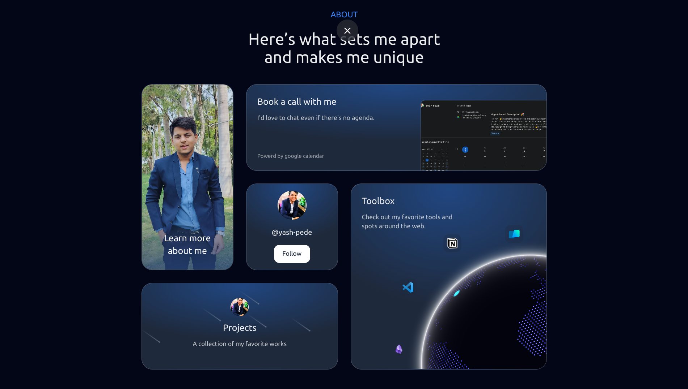

# My Portfolio Website

Welcome to my portfolio! This website showcases my skills, projects, and experiences in Development. Feel free to explore and learn more about my work.

## Table of Contents

- [About Me](#about-me)
- [Technologies Used](#technologies-used)
- [Features](#features)
- [Projects](#projects)
- [License](#license)
- [Contact](#contact)
- [Installation](#installation)

## About Me

I'm an experienced full-stack developer with a passion For design and a knack for tinkering. Web development is my playground, where push
boundaries and chase new horizons.



## Technologies Used

This portfolio is built using the following technologies:

- React
- TailwindCSS
- TypeScript
- Next.js
- Bun
- Aceternity UI
- Nextui
- Framer Motion

## Features

- **Responsive Design**: The website is designed to be fully responsive and accessible on various devices.
- **Project Showcase**: A dedicated section to highlight my projects with descriptions and links.
- **Contact Form**: A simple contact form that allows visitors to reach out to me directly.
- **Animations with Framer Motion**: Utilize Framer Motion for smooth animations and transitions throughout the site.
- **Aceternity UI Components**: Incorporate beautiful Tailwind CSS and Framer Motion components from Aceternity UI to enhance the visual appeal and functionality of the website.


## Projects

Here are some of the key projects showcased in my portfolio:

1. **Pure Pride Pharma**
   - Description: A CRM system for an online Medical manufacturers and distributors. It provides all the users a set of tools to manage their business. It is a modern and efficient solution for managing all your business needs.
   - Technologies: Refine, Supabase, Postgres, Tanstack Query, Vercel
   - [Admin pannel for purepridepharma](https://admin.purepridepharma.in)

2. **AI NoteTaking SaaS - Web Application**
   - Description: A REAL Software-as-a-Service app with AI features and a payments and credits system using the latest tech stack.
   - Technologies: Nextjs, Vercel, Zod, ShadCn, ReactHookForm, Supabase, DrizzleOrm
   - [Cypress](https://shrewit.shop)

3. **Ironman's Jarvis**
   - Description: A python project that converts speech to text and and does talks by understanding it. It was recorded back in 2018 I was still a kid then ignore the quality
   - Technologies: python, Voice-to-text, Google api's, Ollama
   - [JARVIS](https://drive.google.com/file/d/1SJIxvg3gWLVW1rG1DGLJ15xr8dRGCXeh/view?usp=sharing)

## Contact

Feel free to reach out to me:

- Email: yashpede@ssipmt.com
- LinkedIn: [yash-pede](https://www.linkedin.com/in/yash-pede)
- GitHub: [yash-pede](https://github.com/Yash-pede)

Thank you for visiting my portfolio!

## Installation

To view this portfolio locally, follow these steps:

1. Make sure you have Bun installed globally:

   ```bash
   npm install -g bun
   ```
   ```bash
   bun install
   ```
   ```bash
   bun run dev
   ```
   

## License

This project is licensed under the GNU General Public License v3.0. You can redistribute it and/or modify it under the terms of the License as published by the Free Software Foundation, either version 3 of the License, or (at your option) any later version.

This project is distributed in the hope that it will be useful, but WITHOUT ANY WARRANTY; without even the implied warranty of MERCHANTABILITY or FITNESS FOR A PARTICULAR PURPOSE. See the GNU General Public License for more details.

